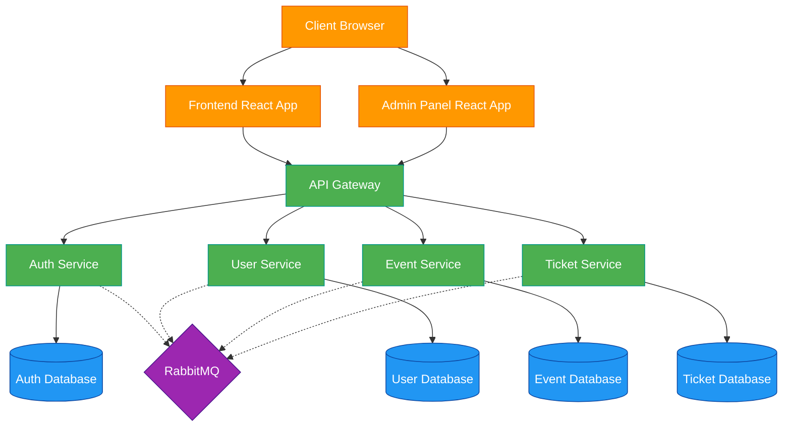

# Ton Ticket - Microservices Ticket Management System

A comprehensive ticket management system built with a microservices architecture.

## Architecture Overview

The system is composed of the following microservices:

1. **API Gateway** - Entry point for all client requests, handles routing and basic request validation
2. **Auth Service** - Manages user authentication and authorization
3. **User Service** - Handles user profile management
4. **Event Service** - Manages event creation and details
5. **Ticket Service** - Handles ticket inventory, reservations, and purchases
6. **Frontend** - React-based user interface

## Architecture Diagram

## Technology Stack

- **Frontend**: React
- **Backend**: Node.js with Express
- **Database**: MySQL (separate database per service)
- **Message Broker**: RabbitMQ for asynchronous communication between services
- **Containerization**: Docker and Docker Compose
- **Database Admin**: PHPMyAdmin for each service database

## Getting Started

### Prerequisites

- Docker and Docker Compose installed
- Node.js and npm installed (for local development)

### Installation and Setup

1. Clone the repository
2. Run `docker-compose up` in the root directory
3. Access the application at `http://localhost:3000`
4. Access PHPMyAdmin at `http://localhost:8080`

## Services and Ports

- Frontend: `http://localhost:3000`
- API Gateway: `http://localhost:3001`
- Auth Service: `http://localhost:3002`
- User Service: `http://localhost:3003`
- Event Service: `http://localhost:3004`
- Ticket Service: `http://localhost:3005`
- RabbitMQ Management: `http://localhost:15672`
- PHPMyAdmin: `http://localhost:8080`

## Data imports

You can download the SQL import files in [db_imports.zip](https://github.com/ThomasHawk11/ton-ticket/raw/main/db_imports.zip)

## API Documentation

API documentation is available at `http://localhost:3001/api-docs` after starting the services.
